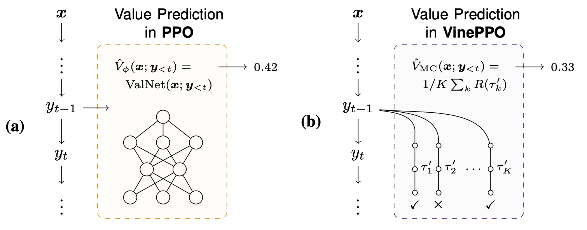

# VinePPO: Unlocking RL Potential For Reasoning Through Refined Credit Assignment
- [Paper](#paper)
- [Abstract](#abstract)
- [Updates](#updates)
- [Quick Start](#quick-start)
  - [Installation](#installation)
  - [Download the datasets](#download-the-datasets)
  - [Create Experiment Script](#create-experiment-script)
  - [Single GPU Training (Only for Rho models)](#single-gpu-training-only-for-rho-models)
  - [Running the experiments](#running-the-experiments)
- [Code Structure](#code-structure)
- [Initial SFT Checkpoints](#initial-sft-checkpoints)
- [Acknowledgement](#acknowledgement)
- [Citation](#citation)




## Paper 
TBD

## Abstract
*Large language models (LLMs) are increasingly applied to complex reasoning tasks that require executing several complex steps before receiving any reward. Properly assigning credit to these steps is essential for enhancing model performance. Proximal Policy Optimization (PPO), a state-of-the-art reinforcement learning (RL) algorithm used for LLM finetuning, employs value networks to tackle credit assignment. However, value networks face challenges in predicting the expected cumulative rewards accurately in complex reasoning tasks, often leading to high-variance updates and suboptimal performance. In this work, we systematically evaluate the efficacy of value networks and reveal their significant shortcomings in reasoning-heavy LLM tasks, showing that they barely outperform a random baseline when comparing alternative steps. To address this, we propose VinePPO, a straightforward approach that leverages the flexibility of language environments to compute unbiased Monte Carlo-based estimates, bypassing the need for large value networks. Our method consistently outperforms PPO and other RL-free baselines across MATH and GSM8K datasets with fewer gradient updates (up to 9x), less wall-clock time (up to 3.0x). These results emphasize the importance of accurate credit assignment in  RL finetuning of LLM and demonstrate VinePPO’s potential as a superior alternative to traditional value network-based methods.*

## Updates
- (Oct 1st, 2024) Initial release of VinePPO codebase.
  
## Quick Start

### Installation
This project is implemented based torch, Huggingface, FlashAttention, DeepSpeed, and vLLM libraries. To obtain the dependencies, we provide the following three ways:

**1. Using pip**
```bash
# Make sure torch 2.1.2 and cuda 12.1 is installed
pip install -r requirements.txt
```
**2. Using Docker**
```bash
sudo docker run \
  --ipc=host \
  --gpus all \
  kazemnejad/treetune:v15.1 \
  python -c "import torch; print(torch.__version__)"
```
*Optional: You can use the following [Dockerfile](https://github.com/McGill-NLP/VinePPO/blob/main/Dockerfile) to build your own image*

**3. Using Singularity Container**
```bash
singularity pull --arch amd64 library://realtreetune/dev/treetune:v15
singularity exec --nv treetune_v15.sif python -c "import torch; print(torch.__version__)"
```
### Download the datasets
```bash
chmod a+x scripts/download_and_prepare_datasets.sh
./scripts/download_and_prepare_datasets.sh
```

### Create Experiment Script

We first specify the configuration file for the experiment, and then, we explain how to run the training and evaluation using a configuration file.

**VinePPO Experiments**
- `configs/polIter_rho1bSft2_vineppo_MATH.jsonnet`
- `configs/polIter_rho1bSft2_vineppo_GSM8K.jsonnet`
- `configs/polIter_deepseekSft2_vineppo_MATH.jsonnet`
- `configs/polIter_deepseekSft2_vineppo_GSM8K.jsonnet`

**PPO Experiments**
- `configs/polIter_rho1bSft2_ppo_MATH.jsonnet`
- `configs/polIter_rho1bSft2_ppo_GSM8K.jsonnet`
- `configs/polIter_deepseekSft2_ppo_MATH.jsonnet`
- `configs/polIter_deepseekSft2_ppo_GSM8K.jsonnet`

**DPO Experiments**
- `configs/polIter_rho1bSft2_dpo_positive_MATH.jsonnet`
- `configs/polIter_rho1bSft2_dpo_positive_GSM8K.jsonnet`
- `configs/polIter_deepseekSft2_dpo_positive_MATH.jsonnet`
- `configs/polIter_deepseekSft2_dpo_positive_GSM8K.jsonnet`

**RestEM Experiments**
- `configs/polIter_rho1bSft2_restem_MATH.jsonnet`
- `configs/polIter_rho1bSft2_restem_GSM8K.jsonnet`
- `configs/polIter_deepseekSft2_restem_MATH.jsonnet`
- `configs/polIter_deepseekSft2_restem_GSM8K.jsonnet`

Once you have selected the configuration file, you can run the training and evaluation using the following script:
```bash

CONFIGSTR="configs/<config_file>.jsonnet"
APP_DIRECTORY="experiments/<path_to_output_dir>"

export APP_SEED="2746318213"
export WANDB_RUN_ID="<unique_wandb_run_id>" # Optional

NUM_GPUS=$(nvidia-smi --query-gpu=name --format=csv,noheader | wc -l)

# Run the training
deepspeed --no_local_rank --num_gpus=$NUM_GPUS  \
         src/treetune/main.py --configs "$CONFIGSTR" \
            run_iteration_loop

# Run the evaluation
deepspeed --no_local_rank --num_gpus=$NUM_GPUS   \
         src/treetune/main.py --configs "$CONFIGSTR" \
            run_evaluation

```

This setup was tested on 4x A100 80GB GPUs for Rho models and 8x H100 80GB GPUs for DeepSeek models.

*PS: Refer to [`src/treetune/runtime/policy_iteration_runtime.py`](https://github.com/McGill-NLP/vineppo/tree/main/src/treetune/runtime/policy_iteration_runtime.py) if you'd like to start reading the codebase.*

### Single GPU Training (Only for Rho models)
Add this config `configs/trainers/devBz16.jsonnet` to the `$CONFIGSTR` variable in the script above:
```bash
CONFIGSTR="configs/<config_file>.jsonnet,\
configs/trainers/devBz16.jsonnet"
```
Note that this is not fully tested and you may need to adjust the batch size to fit your GPU memory.

### Running the experiments
To run the experiments, you can use the following script:
1. Normal local run
```bash
chmod +x run.sh
./run.sh
```
2. Running inside docker
```bash
mkdir -p experiments
docker run \
    --ipc=host \
    --gpus all \
    -v "$(pwd)":/src \
    --workdir /src
    kazemnejad/treetune:v15.1 \
    ./run.sh
```
3. Running inside singularity
```bash
mkdir -p experiments
chmod a+x run.sh
singularity exec --nv \
	-H $(pwd):$HOME \
	-B $(pwd)/experiments:$HOME/experiments \
	/path/to/singularity/image/treetune_v15.sif \
	./run.sh
```
## Initial SFT Checkpoints

|Base Model \ SFT Dataset                | GSM8K                                                                                  | MATH                                                                                  |
|----------------|-----------------------------------------------------------------------------------------|---------------------------------------------------------------------------------------|
| DeepSeekMath   | [🤗 Deepseekmath-SFT-GSM8K](https://huggingface.co/realtreetune/deepseekmath-7b-sft-GSM8K) | [🤗 Deepseekmath-SFT-MATH](https://huggingface.co/realtreetune/deepseekmath-7b-sft-MATH-v2) |
| Rho1B          | [🤗 Rhomath-SFT-GSM8K](https://huggingface.co/realtreetune/rho-1b-sft-GSM8K)                 | [🤗 Rhomath-SFT-MATH](https://huggingface.co/realtreetune/rho-1b-sft-MATH)                 |

## Acknowledgement

This is the release codebase for VinePPO. It is developed by [@kazemnejad](https://github.com/kazemnejad) and [@miladink](https://github.com/miladink).

## Code Structure
- [`configs`](https://github.com/McGill-NLP/vineppo/tree/main/configs): Contains Jsonnet files for configuring experiment settings.
- [`src/treetune`](https://github.com/McGill-NLP/vineppo/tree/main/src/treetune): The main directory for source code, encompassing:
    - [`models`](https://github.com/McGill-NLP/vineppo/tree/main/src/treetune/models): Contains model loading, with [`pretrained.py`](https://github.com/McGill-NLP/vineppo/tree/main/src/treetune/models/pretrained.py) the central piece to load HF models.
    - [`episode_generators`](https://github.com/McGill-NLP/vineppo/tree/main/src/treetune/episode_generators): Manages the episode generation pipelines. The [`math_episode_generator.py`](https://github.com/McGill-NLP/vineppo/tree/main/src/treetune/episode_generators/math_episode_generator.py) script is key for PPO episode generation and [`math_episode_generator_with_mc_advantages.py`](https://github.com/McGill-NLP/vineppo/tree/main/src/treetune/episode_generators/math_episode_generator_with_mc_advantages.py) creates the episodes for VinePPO.
    - [`trainers`](https://github.com/McGill-NLP/vineppo/tree/main/src/treetune/trainers): Contains trainer classes, with [`ppo_trainer.py`](https://github.com/McGill-NLP/vineppo/tree/main/src/treetune/trainers/) is the main PPO trainer which is shared between PPO and VinePPO.
    - [`runtime`](https://github.com/McGill-NLP/vineppo/tree/main/src/treetune/runtime): Integrates components and implements training and evaluation procedures. The [`policy_iteration_runtime.py`](https://github.com/McGill-NLP/vineppo/tree/main/src/treetune/runtime/policy_iteration_runtime.py) script is the **starting point for running experiments.**
  
## Citation
TBD
